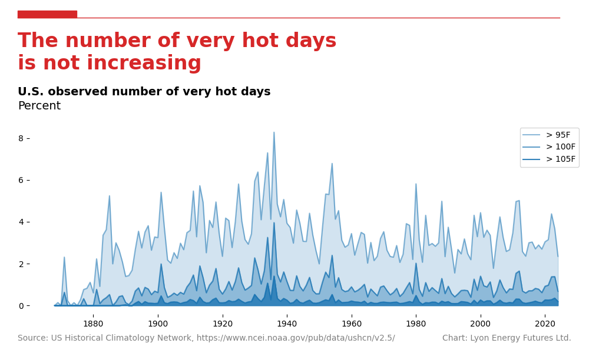

The climate catastrophe industry's core hypothesis and prediction is that an increasing concentration of atmospheric CO2 will produce a catastrophic increase in the earth's temperature.

If that was true, then we would expect to see the frequency of "very hot" days (i.e. days that exceed 95&deg;F) to increase over time. In particular, we would expect to see the frequency rise after the Second World War, when the consumption of hydrocarbon fuels rose exponentially.

The [U.S. Historical Climatology Network](<https://www.ncei.noaa.gov/products/land-based-station/us-historical-climatology-network#:~:text=U.S.%20Historical%20Climatology%20Network%20(USHCN)%20data%20are%20used%20to%20quantify,of%20long%2Dterm%20COOP%20stations>) (USHCN) is a dataset of temperature and preciptitation managed by the National Climatic Data Center (NCDC), which is part of the National Oceanic and Atmospheric Administration (NOAA). It contains daily readings starting around 1880 from 1,800 stations scattered all over the United States---an area of 3.8 million square miles.

We can use this data to evaluate the climate catastrophe hypothesis.

## Getting the data

Unfortunately, it's not easy to get hold of it in raw form. That matters, because [a huge amount of data tampering](https://www.climate4you.com/index.htm) goes on in the climate catastrophe industry to create the illusion that temperatures are rising rapidly. We need the raw data.

As it happens, and possibly unintentionally, NOAA publishes the raw data on an obscure server they own in the form of [a large number of text files](https://www.ncei.noaa.gov/pub/data/ghcn/daily/). While it's not possible to analyse this data directly, it is possible to process it and convert it into a form that can be analysed. So I wrote a Rust utility do so. It's available [here](https://crates.io/crates/ushcn).

## Plotting the data

With that, it's a straightforward task to plot the data. I've written [a python script](https://github.com/rjl-climate/USHCN-temperatures/blob/main/python_ushcn/plots/are_hotter_days_increasing.py) to do it. I remove all of the stations with less than 100 years of data. Then, for each year, I count the number of reports of temperatures that exceed 95&deg;F, 100&deg;F, and 105&deg;F and divide those by the total number of reports in that year to produce a frequency. I then plot the frequency of hot days for each year. If the CO2 hypothesis is predictive, the frequency of hot days will increase. If it isn't, it won't.

## Analysing the data

The frequency of hot days doesn't increase. The frequency of hot days reached a maximum in the 1930s---the "dust bowl" period---then returned in the 1940s to the pre-dust bowl frequency, despite the massive increase after the war in fossil fuel consumption and CO2 emissions.

## Excusing the data

Science expands by explaining the world. Pseudoscience expands by explaining why it doesn't explain the world. As you might imagine, there is a huge amount of "dog ate my homework" excuse making in the climate catastrophe industry that attempts to accommodate this falsifying observation. They all revolve around some variation of the claim---based on synthetic temperature datasets generated by partial computer models---that the atmosphere is heating up everywere _except_ in the most densely and extensively instrumented region of the planet.

_Se laisser vivre_.
