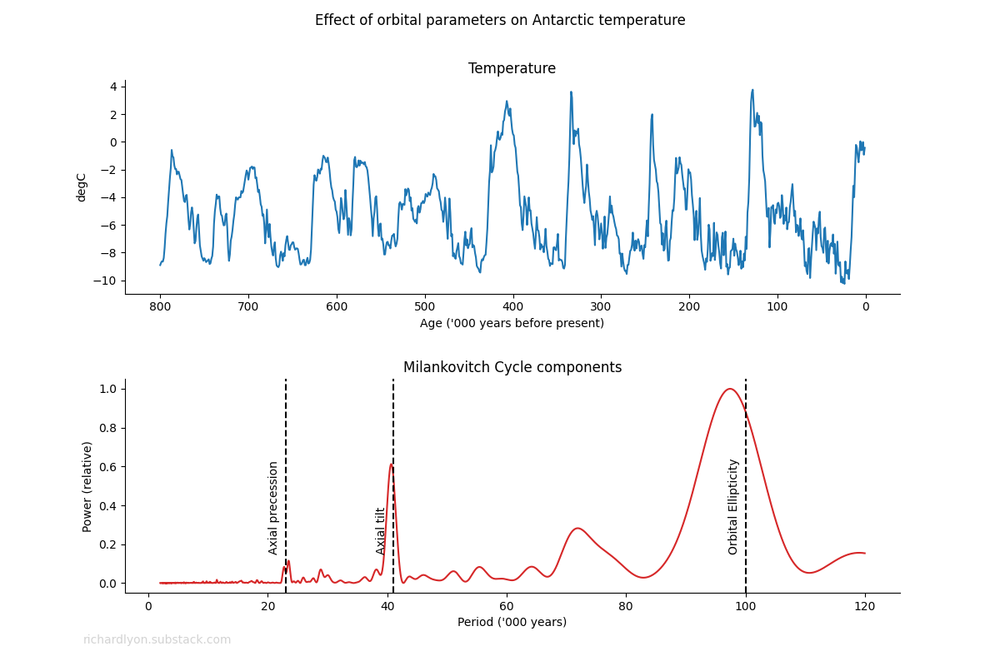
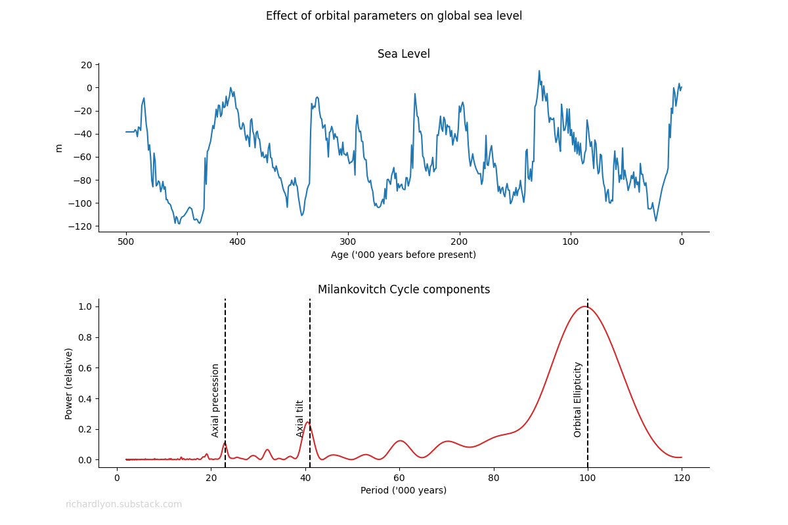
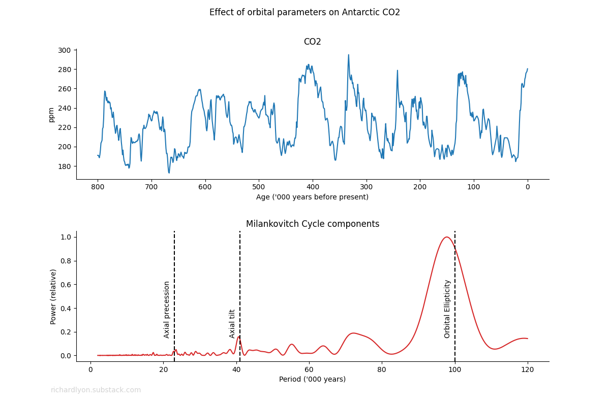
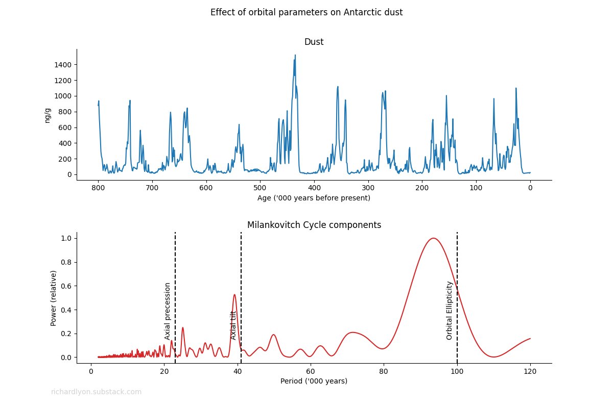

If you add sine waves together of different frequencies, you get a complicated, periodically varying wave. And you can do this in reverse. Any periodically changing waveform can be "reverse engineered" into a set of sine waves that comprise the frequencies that make it up. It's called [the Fourier transform](https://www.youtube.com/watch?v=spUNpyF58BY)---a mathematical technique that was developed in 1807.

As it happens, the earth's temperature, atmospheric CO2 concentration, sea level, and levels of dust have changed periodically over the last 800,000 years. We know this from ice cores that were obtained by the [European Project for Ice Coring in Antarctica](https://en.wikipedia.org/wiki/European_Project_for_Ice_Coring_in_Antarctica) (EPICA) project.

I wrote a [simple python script](https://github.com/rjl-climate/milankovitch-sea-level/tree/main?tab=readme-ov-file) to plot the temperature computed from these cores (Figure 1). The 8 ice ages that have ocurred every 100,000 years in the past 800,000 years are clearly visible.

The script also computes the Fourier transform of the temperature, shown in red in Figure 1. Four frequencies emerge. What are these?

## The Milankovitch Cycle

Briefly. The Earth's orbit around the sun is not a perfect circle. Over a period of about 100,000 years, it varies from a circle to an ellipse. That variation sets up a secondary effect with a period of about 75,000 years. Nor is the axis that the earth spins around perpendicular to the plane of the orbit. It tilts, and the angle of the tilt varies over a period of about 41,000 years. And as well as tilting, it rotates over a period of about 26,000 years. The whole thing is called [the Milankovitch cycle](https://www.nature.com/scitable/knowledge/library/milankovitch-cycles-paleoclimatic-change-and-hominin-evolution-68244581/).

As the Earth's axis wobbles, the amount of sunlight we receive, and therefore the amount of heating we experience, varies. As a result, the Earth's temperature varies over a range of about 8 degrees.

## Sea level

Not surprisingly, with the temperature going up and down like a yo-yo, so too does sea level. A lot. It varies over a range of about 100m. And when you run Fourier analysis on that, the same Milankovitch frequencies appear (Figure 2.)

## CO2

This is where it gets really interesting. CO2 is a temperature dependent byproduct of various chemical processes taking place within the Earth's biochemical and geological processes. When temperature goes up, CO2 goes up. And when temperture goes down, CO2 goes down. And when you run Fourier analysis on that, the same Milankovitch frequencies appear (Figure 3.)

## Dust

The frightening one is dust. We are emerging from a near-extinction level CO2 famine. Optimal CO2 levels for growth are up around 1000 ppm---we are still only at around 430 ppm. Plunging CO2 levels have resulted in mass desertification of the planet, creating vast quantities of dust that have settled at the poles. And when you run Fourier analysis on that, the same Milankovitch frequencies appear (Figure 4.)

## The climate catastrophy industry's reaction

Needless to say, this is not a very welcome observation in the climate catastrophe industry. You'll recall that infinitessimable changes in temperature are supposed to be explainable, and _only_ explainable, as the result of our negligible addition to the annual natural production of CO2. To be fair, most I've spoken to are simply unaware of this simple demonstration of the causal relationship between temperature and CO2.

**POTSCRIPT. As we immiserate ourselves blowing hundreds of trillions of dollars on the attempt to prevent the weather getting a little milder: the next Ice Age appears to be overdue.**