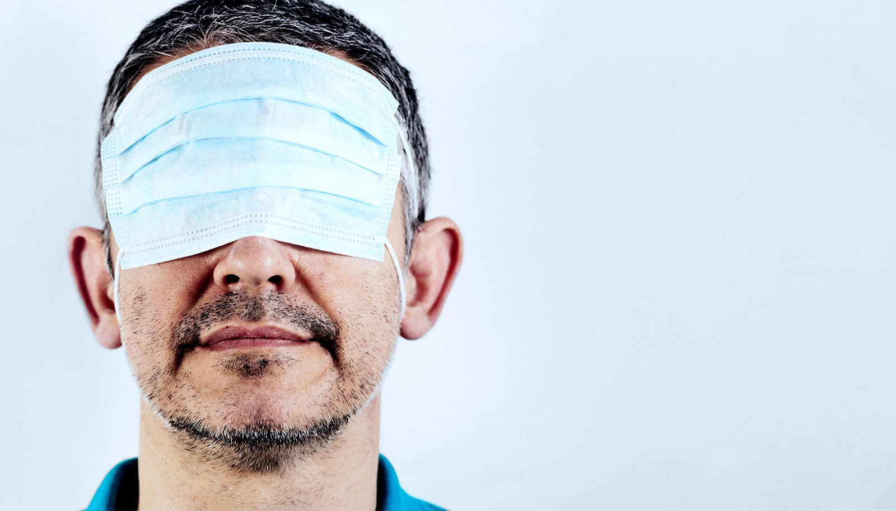
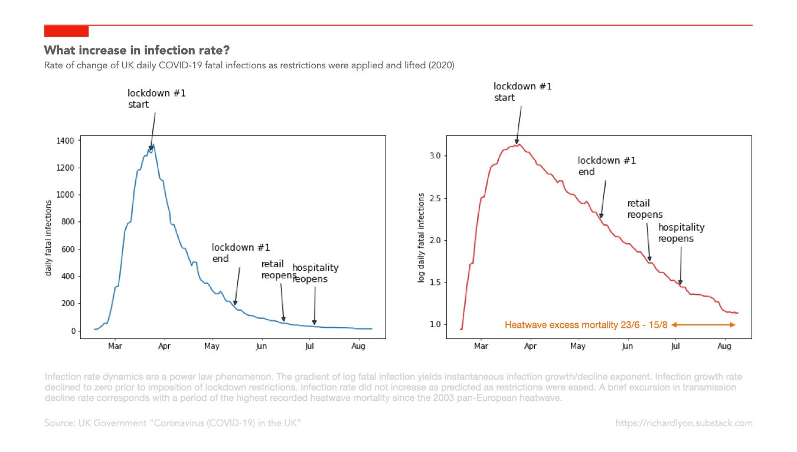

It's not possible to stop the spread of, or eradicate, infectious respiratory disease, and it’s a waste of public health resources and capacity to try. There’s very limited scientific evidence that restrictions on mass gatherings have any significant effect on virus transmission. Even a 99.9% international travel restriction might delay the pandemic wave by only a month or two, and there should be no plan to close borders. There’s very little evidence of widespread benefit from the wearing by the public of facemasks.

That’s not my opinion. It’s the advice given by the Scientific Advisory Group for Emergencies (SAGE) to the UK Government a year ago today (4th February 2020). In the minutes of the Fourth SAGE meeting on Wuhan Coronavirus held on 4th February, they wrote: _“6. SAGE agreed that HMG should continue to plan using current influenza pandemic assumptions, which can be modified as data becomes more certain”._[^1]

## "Promoting a return to normality”

Those assumptions were set out in the Department of Health’s _“UK Influenza Pandemic Preparedness Strategy 2011”_ documenting the UK-wide strategic approach to responding to a respiratory illness pandemic.[^2] The strategy, developed a decade ago and updated regularly since, was created jointly across the four UK Governments by NHS, social care, and public health organisations, and based on advice from clinical and scientific experts. Written for an influenza pandemic, the strategy noted that the plans were suitable for other infectious diseases with altogether different patterns of infectivity, such as Severe Acute Respiratory Syndrome.

The “reasonable worst case” scenario assumed that up to 2.5% of those with symptoms would die as a result of infection. It noted that, in both the 2009/10 and 1999/2000 influenza seasons, day-to-day life for most people continued largely unaffected. The objective, it said, was to _“Minimise the potential impact of a pandemic on society and the economy by promoting a return to normality and the restoration of disrupted services at the earliest opportunity"_. Government policy was to be unambiguous: _“The UK Government does not plan to close borders, stop mass gatherings or impose controls on public transport during any pandemic”_.

By March 2020, initial estimates of the fatality rate were showing far lower values than the scenario assumption in the Strategy (0.3% vs. 2.5%).[^3] By the middle of March 2020, responding to the natural change in public distancing behaviour as news of the virus spread, the growth rate of new fatal infections (modelled from recorded deaths) had fallen from its high initial value to zero.

## The reversal, and its costs

Yet on 16th March, the Health and Social Secretary Matt Hancock told the House of Commons that “unnecessary social contact” should cease. On 23rd March 2020, the Prime Minister Boris Johnson told people that they “must stay at home”.

Before COVID-19, no democracy in human history had ever attempted to contain the spread of an infectious disease by closing down its economy and quarantining its healthy citizens under house arrest. Yet without any published scientific analysis, without any analysis of the social and economic consequence, and with no debate in its Parliament, the UK Government reversed a decade of UK strategic pandemic planning, and commenced a speculative policy of mandatory business closures and stay-at-home notices that continue to this day.

In July 2020, The Office of National Statistics published a summary of estimates of the deaths caused by the economic, medical, and mental health impacts of this abrupt policy reversal.[^4] It estimated that a 2 month lockdown would cause the loss of up to 540,000 “Quality Adjusted Life Years”, noting that _“...when morbidity is taken into account, the estimates for the health impacts from a lockdown and lockdown induced recession are greater in terms of [Quality Adjusted Life Years] than the direct COVID-19 deaths”_.

This raises a very obvious and important question: **Why did the UK Government, responding to an infectious respiratory disease pandemic caused by a virus with one tenth of the lethality assumed in existing strategic plans, overturn a decade of expert opinion’s rejection of lockdowns and implement instead at national scale an experimental policy estimated to result in the loss of up to 540,000 years of life?**

The ONS study stated its reason: _“...without mitigations, a far larger number of people would have died from COVID-19”._ But this claim was based on two critical and wildly inaccurate assumptions: an estimate of an infection fatality rate of 4%, suggested by Professor Neil Ferguson at Imperial College London; and a lockdown duration of 2 months.

When data about the much lower infection fatality rate emerged, the ONS didn't reduce its estimate of COVID-19 deaths. When the lockdown was extended from 3 weeks to “flatten the curve”, to the Autumn to “protect the NHS”, to the winter to “allow the vaccine rollout”, it didn't increase its estimate of collateral deaths.

But by using the relationship between Gross Domestic Product and life expectancy, the Faculty of Public Risk at the University of Bristol estimated that the recession created by the 9% reduction in GDP generated by lockdown policies would, in the long run, cause the loss of up to 560,000 lives in the UK.[^5] By comparison, they estimated that 45,000 lives (converted to “equivalent life expectancies” to account for the short median remaining life expectency of COVID-19 victims and long median remaining life expectancy of lockdown victims) would have been lost to COVID-19 if no mitigations were made.

So, how did we end up in this state? Because a decision that was made on the basis of an early and, as it turned out, catastrophically wrong assumption about a fatality rate was not revised when better information became available.

## “We couldn’t get away with it in Europe”

The motive for failing to update the cost/benefit analysis of the lockdown will be a matter for the future Public Enquiry to examine. The opportunity that led to the policy change, however, is clear. Professor Neil Ferguson:[^6]

> ‘[China] is a communist one-party state,’ we said. ‘We couldn’t get away with it in Europe,’ we thought. And then Italy did it. And we realised we could.

Professor Ferguson was forced to resign in disgrace from SAGE after violating the stay-at-home order he was instrumental in imposing on others. Tragically, however, the failure to understand the limits of his models, and of the modellers themselves, was already well recognised. In her independent review of the 2009 influenza pandemic, Dame Deirdre Hine said:[^7]

> Early and emerging data should always be of some use, but its employment should be carefully managed. This is not to reject the use of models, but to understand its limitations: modellers are not ‘court astrologers’.

Additionally:

> Decision-makers must not rely on the model to make a decision for them but be prepared to use it as part of a process in which other factors, such as the “riskiness” of a policy, are weighed.

A year later, the data is in. By reversing its respiratory infection pandemic policy, Britain has inflicted on its citizens one of the most authoritarian and expensive Covid-19 responses in the world. The decision to reverse a decade of expert guidance and policy has been, by its own standards, a failure: the fourth highest death rate in the word—far higher than regimes that implemented far less restrictive regimes. The only European country with a higher death rate—Belgium—implemented even harsher restrictions.

Only time will reveal the magnitude of the catastrophic harm that this “risky” policy created. Sadly, it will be too late for the thousands identifed in the Government’s studies who will die now of withheld medical treatments and poverty, for the thousands of those with failed businesses and lost livelihoods, for the thousands of victims of depression and anxiety and mental illness and isolation and loneliness, and for the thousands of children who’s education and life prospects have been irreversibly damaged. We can only wonder now at what might have been if Government had recalled Dame Hine’s recommendation not to treat their advisors as astrologers.

It’s essential that we don't let them “get away with it” next time.

[^1]: Vallance, P., & Whitty, C. (n.d.). SAGE 4 minutes: Coronavirus (COVID-19) response, 4 February 2020 - GOV.UK

[^2]: Department of Health Pandemic Influenza Preparedness Team. (2011). UK Influenza Pandemic Preparedness Strategy 2011.

[^3]: Heneghan, C., & Oke, J. (2020). Global Covid-19 Case Fatality Rates. The Centre for Evidence-Based Medicine.

[^4]: Office for National Statistics. Direct and Indirect Impacts of COVID-19 on Excess Deaths and Morbidity.

[^5]: Thomas, P. (University of Bristol). (2020, November 8). Is the cost of another lockdown too high? The Spectator.

[^6]: Whipple, T. (2020, December 25). Professor Neil Ferguson: People don’t agree with lockdown and try to undermine the scientists. The Times.

[^7]: Hine, D. (2009). The 2009 Influenza Pandemic: An independent review of the UK response to the 2009 influenza pandemic.