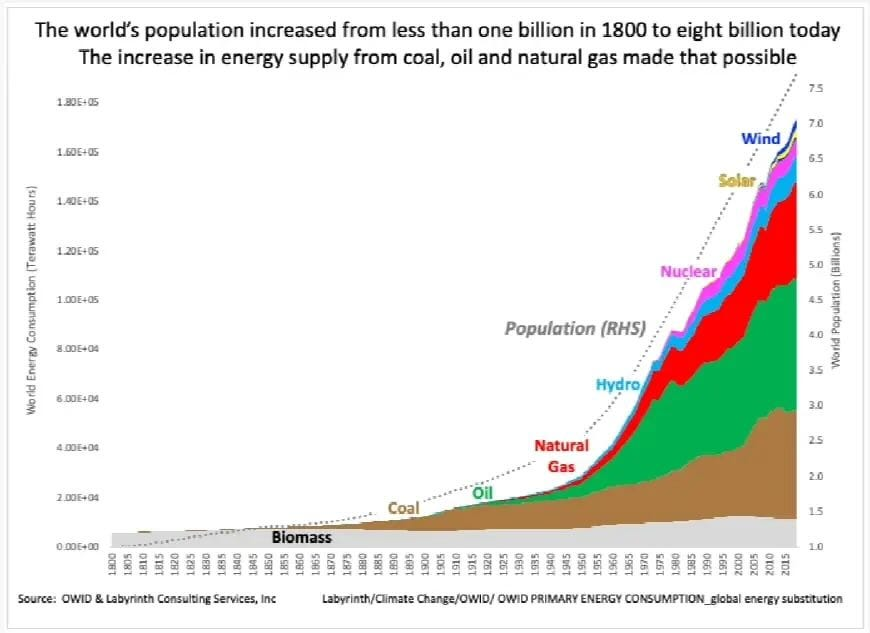
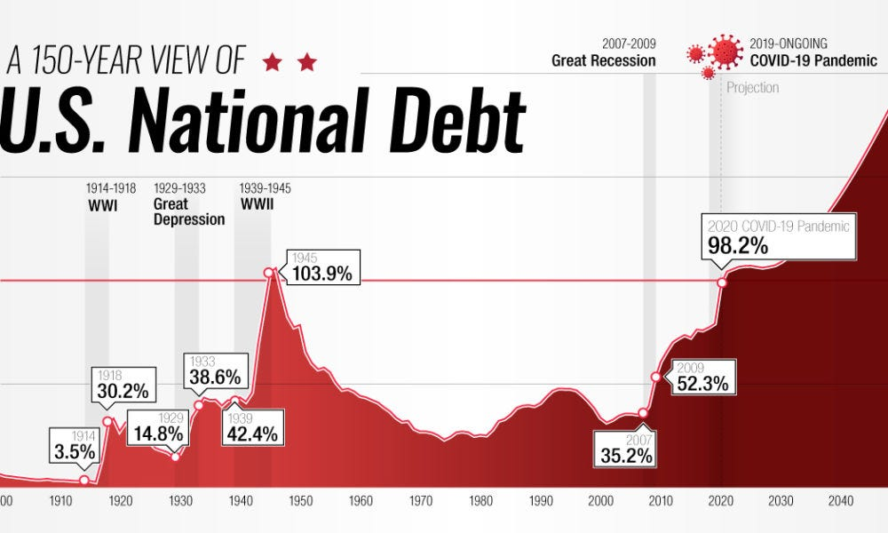
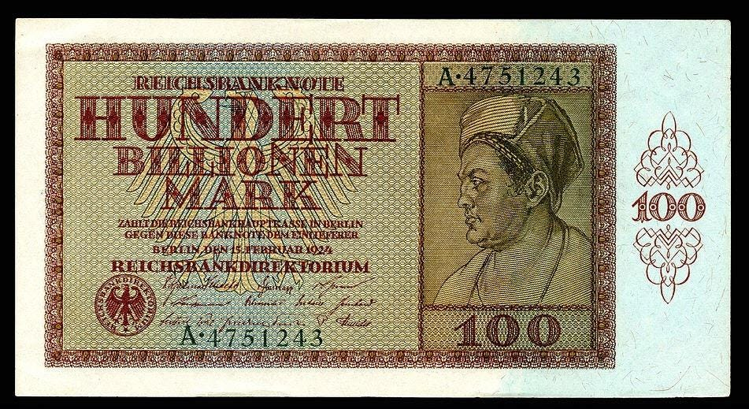

Destroying our affordable, productive energy sources and replacing them with ones based on occasional summer breezes, sunbeams, and assorted gizmos for keeping hospitals powered up during our prolonged wind droughts is unimaginably expensive.

McKinsey’s, a respected management consultancy firm that specialises in estimating the cost of Big Projects, estimates that implementing Net Zero policies by 2050 will cost $275 trillion world wide.[^1] That estimate overlooks the problem that most of the required technologies don’t exist. Adding a conservative 60% bumps that cost up to $440 trillion.

The UK’s Royal Society notes that Net Zero policies significantly underestimate the unreliability of wind and sun, and therefore long term storage cost. They add another £1 trillion in storage cost to the UK’s Net Zero bill—£40,000 per household.[^2] Others have done the same for the US, adding $220 trillion to theirs.

A trillion pounds—£1,000,000,000,000—is...a lot of money. At £1 per second, spending a thousands pounds takes 17 minutes; a million pounds takes 278 hours; a billion pounds takes 32 years; and a trillion pounds takes 31,710 years. To fund Net Zero, we’d need more money than God.

The more thoughtful climate catastrophists and unreliable energy enthusiasts are starting to notice a problem: where in God’s name is that amount of money to come from?

---

Help is at hand, some believe, in the form of an eccentric financial theory called “Modern Monetary Theory” (“MMT”). It won’t work. The details are a little dry, but to understand why it won’t work, we have to understand how it’s supposed to.

In conventional economic theory, the size of a government’s budget is limited by the amount it can raise through taxation, borrowing (public debt), and monetisation (creating money). Those, in turn, are limited by the rate at which the economy can grow: if borrowing and monetisation grow faster than the economy (and therefore taxation) for too long, many problems can occur.

Of those, the one that interests us here is inflation. “Money”, amongst many other things, is a token that represents something of value in the economy. If the number of money tokens rises faster than the number of things of value in the economy then, over time, the money tokens that you own are convertible into fewer and fewer things of value. Another way of saying this is that prices rise. We call this price rise “inflation” and, when it is really bad, “hyperinflation”. Hyperinflation is when a wheelbarrow of money tokens is worth less than the wheelbarrow.

“No no!”, says the Modern Monetary Theorist, “How very old fashioned! My country issues its own currency. The government budget is not limited by taxes or borrowing. For as long as there are idle resources in the economy, and the government chooses the right policies, the government can spend like a drunken sailor. And it doesn’t even have to raise taxes or increase borrowing—it can simply create money as required!”

Sounds fabulous. Sounds, in fact, like a Magic Money Tree. A government could print trillions of pounds and everyone could get wealthier. Needless to say socialists, and the $440 trillion climate catastrophe industry, think Modern Monetary Theory is just the ticket.

But before getting too carried away by how simple it is and wondering why no-one has thought of solving our problems by printing money before, let’s focus for a moment on the key phrase in Modern Monetary Theory: “For as long as there are idle resources in the economy”.

Then let’s remind ourselves of how this is all supposed to work. The government prints trillions of money tokens and dumps them out of helicopters into the streets. Citizens pick these up and convert them into goods and services. The quantity of goods and services rises in proportion to the number of money tokens, giving them value and preventing inflation. The economy grows, tax revenues rise, and a thousand unreliable energy consultancies blossom.

And how are money tokens converted into goods and services? With two things. Idle resources. And high gradient energy. Because to convert idle resources into goods and services, you need high gradient energy.[^3] The more high gradient energy you have, the more goods and services you can convert idle resources into.

It follows, therefore, that the less high gradient energy you have, the fewer goods and services you can convert idle resources into. With insufficient high gradient energy, or with energy of insufficient gradient, even if you have idle resources, printing money tokens and dumping them out of helicopters won’t produce goods and services. It will produce inflation. Then hyperinflation.

---

And this is where the wheels fly off the MMT charabanc spectacularly.

For the entire period that economists have been observing economies and making theories about how they work—Adam Smith wrote the foundation of modern economic thought[^4] here in Edinburgh in 1776—the quantity of energy that drives industrial economies has grown enormously. And that growth has been so consistent and reliable that economists don’t really think about it, any more than fish think about water. To the extent that they do, they imagine it to be a commodity, like rice: just another kind of resource that can be created as needed, and substituted at will.

Not only has the quantity of energy grown, but the gradient of that energy—the rate at which it can be converted into work—has increased. Over the last 2000 years, human society has undergone a series of energy transitions—human labour, to animal labour, to wood, to charcoal, to whale oil, to coal, to oil, to gas, to nuclear. In each transition, an energy source of lower gradient has been replaced by one of a higher gradient.

In fact, that is how we’ve managed to create energy transitions. Building out a new energy infrastructure while keeping everyone alive[^5] is conditional on having vast amounts of surplus energy. It is only by having large reserves of the current energy sources, and transitioning to a higher gradient one, that allows this condition to be met.

Throughout this time, while all of this energy expansion has been taking place, we’ve been creating money. Modern Monetary Theorists, unaware of the relationship between energy and money, have observed this and concluded that money creation has caused the economy to expand. In fact, expanding the net supply of high gradient energy has allowed the economy, and therefore the money supply, to expand.

In [our previous essay](/writing/peak-oil-and-fake-money/) we saw that, even without suidicidal “Net Zero” ideology, net energy is no longer expanding. The supply of affordable oil—the dominant energy source—has reached the point where it cannot grow any more, and is now contracting. Unless and until we replace it with new volumes of gas and nuclear, contraction of the net output of our energy system will accelerate.

Instead, we’ve responded in the worst way possible: shutting down our oil and gas replacement processes, printing vast quantities of money tokens, and using them to accelerate energy contraction by creating low gradient energy sources (“wind” and “solar”).

Have you noticed the vast amount of debt and funny money that’s been created since 2008 as a result? Have you noticed how your money tokens can be converted into fewer and fewer goods and services? Have you noticed wages stagnating, public services deteriorating, and everything becoming shabbier around us?

This is the onset of Modern Monetary Theory colliding with a situation it never imagined, much less accounted for in its theories: net energy contraction.

---

More and more pundits are claiming that Britain, as an issuer of a sovereign, reserve currency, faces no intrinsic financial constraints on spending, and can print as much of its currency as it likes to fund a lavish welfare state, massive state sector salaries and pensions, and their “Net Zero” ideology.

Ignore them. Economics is a social “science”. Most economists have had no significant education in the physical sciences, and are therefore not even aware that they are unaware of the non-negotiable dependency that money has on our energy system, or of the contraction taking place in that energy system.

Some of them, supposing wrongly that energy is a commodity, even believe that high energy gradient coal, gas, and nuclear power generation plants can be replaced by millions of low gradient sources like wind turbines—like supposing that a steep slope can be created by joining together, end-to-end, lots of shallow slopes.

Economic history is littered with examples of hyperinflation. For example, in the Weimar Republic it caused the destruction overnight of people’s life savings, soaring prices, wage devaluation, food scarcity, and rising infant mortality. In destroying Germany’s middle classes, it ushered Hitler to power and paved the way for the Second World War.

It might be wise to familiarise yourself with that period of history, if you aren’t already. Because that is the kind of future that “Modern Monetrary Theory” will propel us toward, if we let them inflict it on us.

[^1]: McKinsey (2022) A net-zero economy: The impact of decarbonization. McKinsey Sustainability. Available at: https://www.mckinsey.com/capabilities/sustainability/our-insights/the-economic-transformation-what-would-change-in-the-net-zero-transition

[^2]: Llewellyn Smith, C. (2023) Large-scale electricity storage. The Royal Society. Available at: https://royalsociety.org/news-resources/projects/low-carbon-energy-programme/large-scale-electricity-storage/

[^3]: For an explanation of the difference between high gradient energy and low gradient energy, and why the economy needs high gradient energy to function, see my substack essay Lyon, R. (2024) _‘The physics of Net Zero’_, The State of Britain by Richard Lyon, 3 August. Available at: https://richardlyon.substack.com/p/the-physics-of-net-zero

[^4]: Smith, A. (1776). _An inquiry into the nature and causes of the wealth of nations._ London: W. Strahan and T. Cadell.

[^5]: For example. The earth’s population today is around 9 billion people. Of those, the lives of around 4 billion depend on food grown with fertiliser made with hydrocarbon. If we were to take Green billionaire funded “Just Stop Oil” at its word and just stop oil then, within a decade, we would experience deaths from starvation, malnutrition and disease measured in hundreds of millions or billions. That is why energy transitions can only ever take place “upward”. Human history is litered with civilisations that have transitioned “downward”, usually as a result of exhaustion of their energy resources. We call them “collapses”. Net Zero is the attempt to transition “downward”.