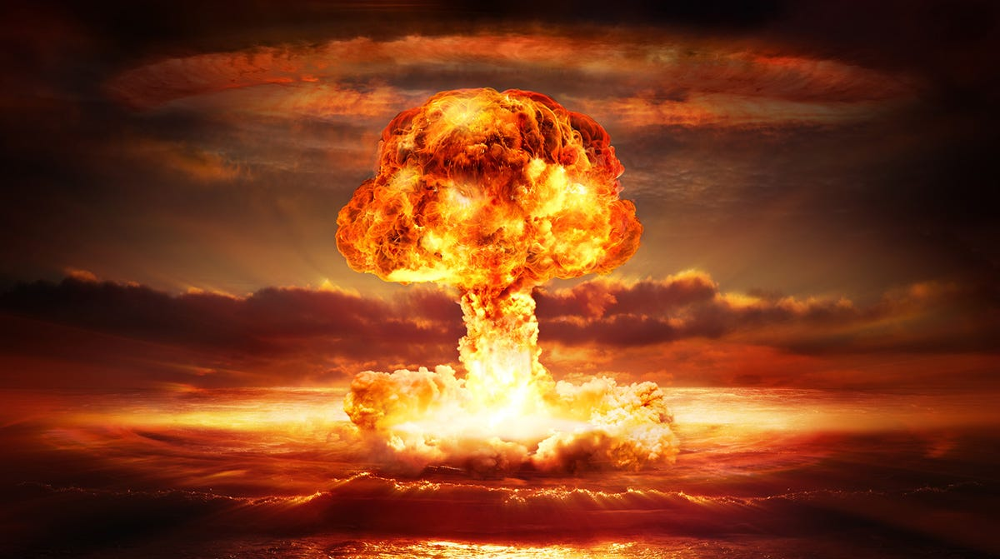
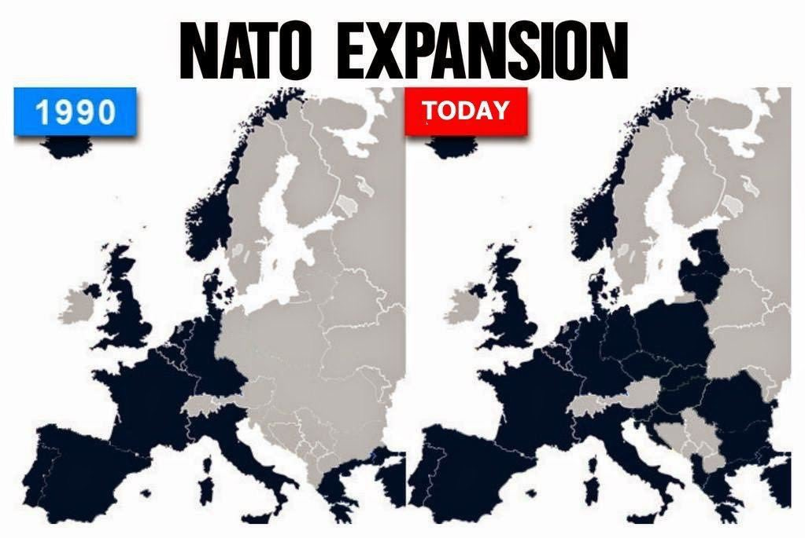

TV comedian Volodymyr Zelensky was elected President of Ukraine on April 21, 2019 on a 73% landslide vote. A key element of his campaign was a promise to pursue a peaceful settlement with Russian-backed separatists in Eastern Ukraine.[^1]

In that same month, the influential US military think tank RAND Corporation published a startling report outlining bold policy measures that the US and NATO could implement to destabilize Russia’s government. The report’s remarkably frank recommendations included strategies that could potentially lead to regime change.[^2]

These measures, which contradicted President Zelensky’s election promises to Ukrainian citizens, included: supplying lethal weapons to Ukraine to escalate its conflict with Russia; recommitting to Ukraine’s integration into an expanding NATO; repositioning NATO fighters, bombers, tactical and nuclear missiles, and troops along the Russian border to exert pressure on Russia’s military defenses; and interfering in Russian elections to undermine public confidence in the Russian government.

In December 2021, Russia sought security guarantees from the United States and NATO that they would not implement these measures. NATO refused. Russia invaded Ukraine on February 24 2022.

In March 2022, during initial peace negotiations, Russia reiterated its demand for security assurances from NATO. President Zelensky indicated openness to forgoing Ukraine’s NATO membership aspirations. The United Kingdom, under Boris Johnson, sabotaged the talks.[^3] An estimated 600,000 Ukrainian men were subsequently killed.

In January 2024, the head of the British Army General Patrick Saunders signalled his enthusiasm for conscripting us into a “citizen army” in readiness for a land war with Russia.[^4] And in November 2024, UK trained Ukrainian forces began firing UK manufactured and supplied air-launched, long-range, advanced guidance system equipped supersonic cruise missiles deep into the most nuclear-armed country in the world.

Until recently, the most newsworthy aspect of Ukraine was its history of corruption, ultranationalism, neo-Nazism, antisemitism, and its persecution of ethnic Russians and other minorities.[^5] Since then, the UK as spent £18 billion on it in a proxy war with Russia.

## Life happens fast

During the Cold War, the RAND Corporation—authors of the NATO strategy currently being enacted to destabilise Russia—contributed significantly to the doctrine of Mutually Assured Destruction (MAD). The MAD doctrine is a military strategy asserting that if two opposing sides possess the capability to inflict unacceptable damage on each other with nuclear weapons, neither side will initiate a conflict, as it would lead to total annihilation for both.

In a terrifying new book, Annie Jacobsen—drawing on expert testimony and recently declassified information from the US nuclear military program—sets out, minute by minute, the events that would unfold after a hypothetical surprise dual decapitation strike by North Korea on Washington DC and Diablo Canyon nuclear power station in California.[^6] The scenario, from first detection to the death of the first billion humans, takes a little over 60 minutes. Most of humanity perishes subsequently in the ensuing nuclear winter.

The book reveals critical aspects of the global nuclear system. It highlights that any U.S. missile response to North Korea must traverse Russian airspace. Crucially, Russia’s satellite detection system cannot differentiate between missiles flying over its territory and those targeting it directly. This distinction is vital because both Russia and the U.S. employ a “Launch on Warning” strategy, where nuclear responses are initiated before an actual strike occurs. Furthermore, the Russian system incorporates a “Dead Hand” mechanism: if a nuclear detonation is detected on Russian soil after losing contact with central command, it automatically launches all operational missiles at predetermined targets.

The whole point of Mutually Assured Destruction doctrine is to deter behaviour that could trigger a launch. Jacobsen shows that, when that doctrine fails, every single scenario leads to the launch of all nuclear weapons, and annihilation of the human species.

Russia has reportedly revised its nuclear doctrine, lowering the threshold for nuclear weapon use compared to NATO’s current stance. The absence of a nuclear exchange thus far is therefore attributable only to Russia’s restraint rather than a lack of conditions meeting their criteria. This situation has heightened global nuclear tensions to unprecedented levels.

It is under these circumstances that the UK Prime Minister, who came to power with only 20% of the electoral vote, is now firing missiles at Russia.

NATO’s pivot from a defensive military alliance to an expansionist offensive military force is moving fast. Since this map was created, Finland and Sweden have been subsumed.

As a former Royal Air Force Officer, I underwent NATO military doctrine training. NATO was presented as a defensive military alliance, not an expansionist, offensive military force. Nuclear weapons were portrayed as deterrents, their potential consequences so catastrophic that they theoretically prevented aggression—on both sides. NATO doctrine emphasized the importance of neutral buffer states like Ukraine, Finland, and Sweden in reducing tensions between Western and Soviet blocs and minimizing the risk of nuclear conflict. While acknowledging the potential disappointment of these nations in being denied NATO membership, this was viewed as preferable to the alternative: a nuclear exchange that could render Europe uninhabitable for millennia.

I was prepared to serve in conflicts guided by that doctrine. However, the strategic landscape has changed out of all recognition. I will not participate in General Patrick Saunders “citizen army”. And I’m not alone. The gradual disappearance of Ukrainian flags from social media profiles reveals waning public enthusiasm for this mad war.

[^1]: _Ukraine’s president elect promises new peace talks_ (2019) RFI. Available at: https://www.rfi.fr/en/europe/20190421-ukraines-president-elect-promises-peace-talks. “In any case we will act within the Normandy framework, we will continue with the Minsk talks, we will reboot them” 

[^2]: Dobbins, J. _et al_. (2019) _Overextending and Unbalancing Russia: Assessing the Impact of Cost-Imposing Options_. RAND Corporation. Available at: https://doi.org/10.7249/RB10014.

[^3]: Orbán, T. (2023) Official: Johnson Forced Kyiv To Refuse Russian Peace Deal. Available at: https://europeanconservative.com/articles/news/official-johnson-forced-kyiv-to-refuse-russian-peace-deal/

[^4]: Sheridan, D. (2024) ‘Ukraine conflict shows calling up public can win wars, says UK Army chief’, _The Telegraph_, 24 January. Available at: https://www.telegraph.co.uk/news/2024/01/24/head-army-ukraine-citizens-conflict-win-wars/

[^5]: _The dangers of ignoring Ukraine’s neo-Nazis_ (2023) The Tufts Daily. Available at: https://www.tuftsdaily.com/article/2023/10/the-dangers-of-ignoring-ukraines-neo-nazis?t

[^6]: Jacobsen, A. (2024). _Nuclear War: A Scenario_. New York, NY: Dutton. https://amzn.eu/d/0H8eEnB