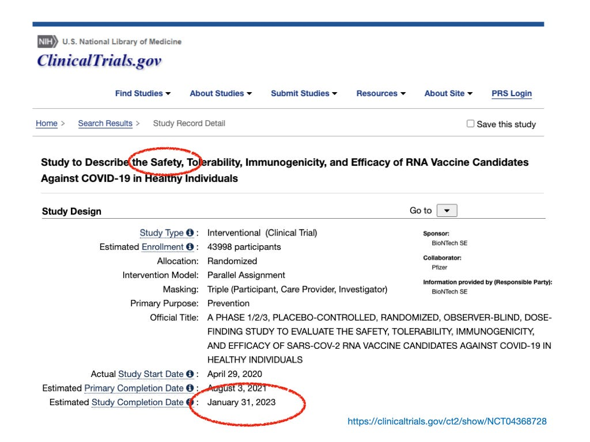

Before lockdown brought my livelihood to an abrupt halt, I commuted every month to West Africa. There, I was exposed to viruses that were much more likely than SAR-CoV-2 to harm me. Vaccines have undoubtedly prevented me from becoming seriously ill, and have possibly saved my life. I’m a fan of vaccines.

Of licensed vaccines, that is to say.

\[This statement has given rise to an enormous debate in the US about what the law means by it. When evaluating it, I find it helpful to remember that (i) our immune system is critical for our health, complex, and poorly understood, and (ii) vaccines are substances engineered to attack it.\]

US Law offers perhaps the most bracing statement about the fundamental nature of vaccines: they are “unavoidably unsafe”. A licensed vaccine is therefore one that has necessarily undergone lengthy and stringent safety trials to assess the risk of both short and long term side effects. Only on passing these trials can it then be duly licensed and authorised by Government for public use. In the UK, this is done under the Human Medicines Regulations 2012.

Vaccines are “unavoidably unsafe” because the human immune system is still relatively poorly understood. Most vaccines are an educated guess about what your immune system will do after you’ve been injected with a substance that has been specifically engineered to attack it. That guess is sometimes wrong. For example, if you have already been exposed to dengue fever, its vaccine helpfully boosts your immunity. If you haven’t—say, if you are a child—it can cause severe hemorrhagic dengue fever.[^2]

It’s the long term safety trial that discovers these things.

For the COVID-19 experimental vaccine candidates, the long term safety trial is even more important. Not only is the vaccine untested in humans, the technology the vaccine is based on—_mRNA_—is experimental, and has never been used in humans. This technology is as different from the vaccines you’ve had previously as nuclear reactors are from petrol engines. The kinds of vaccine you’ve had before generally work by giving your body’s immune system a weakened version of the virus to practice on. _mRNA_ technology works by co-opting your cells’ machinery, loading a program into it, and getting it to replicate a specific fragment of the virus for the immune system to practice on.

Along with this experimental technology therefore comes a whole new set of educated guesses. How does the immune system respond just to fragments? How does an immune system trained on fragments respond to the whole virus, or a variation of the virus, or a similar virus? Where else in the body does the vaccine end up beside the injection site, what does it do when it gets there, and how long does it stay? How does the body respond to other components, some of them toxic, that now have to be added to stabilise the fragile vaccine? Will the cell machinery stop churning out fragments when it is intended to?

No-one knows at present, because there isn’t enough long term experience of them to know. Like nuclear technology, genetically modified food, and artificial intelligence, it might be terrific. And then again, it might not. And like those technologies, some of the most serious potential side effects of _mRNA_ technology are truly nightmarish: for example, if it modified DNA in your reproductive system, it could create harmful genetic disorders that are hereditary.

So, since our Government is getting ready to inject these novel experimental substances into our children (whose immature immune systems are still developing, by the way, adding yet _another_ set of educated guesses), and is preparing to coerce us into participation in a country-scale medical experiment under threat of exclusion from large parts of our society through a biometric surveillance system: it would be comforting to know that they at least are licensed, wouldn’t it?

Well it turns out they aren’t. They are _authorised_. But they aren’t _licensed_. That’s because they aren’t currently _licensable_—you can no more compress a long term safety trial into a short one than you can compress a baby’s nine month gestation into four. The first long term trial to test the manufacturers’ guesses about the safety of RNA vaccine candidates in healthy people won’t arrive until 2023:

Until then, any Government statement about the safety of these experimental vaccines is a statement about the educated guesses that their manufacturers have made about their safety. Manufacturers who are the most sued and fined companies in US corporate history, for lying about the safety of their products. Manufacturers who will make billions of dollars of profit if they turn out to be safe, and are protected in law from prosecution by you if they don’t. They are made on the same basis that the owners of the Titanic reassured passengers, before it sailed, that it was unsinkable. Which it was—on paper.

So what does a government do that has unwisely positioned vaccination as the only way out of the hole it’s dug itself into after confecting hysterical public overreaction to a virus with, for the majority of its citizens, a 99.98% survival rate?[^3] It bypasses the safety regulations that define the standard licensing and authorisation procedures that all pharmaceutical companies must pass before their products are approved for broad use.

It’s bypassed them through the emergency powers granted under Regulation 174 of the Human Medicines Regulations 2012. These grant the Government the power to authorise named vaccine manufacturers to place their experimental vaccine candidates on the market without first having to comply with the licensing and authorisation Regulations. But this would have placed those manufacturers at risk of civil prosecution in the event of you suffering injury and death as a result of their experimental products. So the government has also changed Regulation 345 to prohibit you from suing the manufacturers for supplying an unlicensed product. Finally, as a consolation prize, the Government has added the experimental vaccines to the list of recognised vaccines under the Vaccine Damage Payment Scheme[^4]—itself introduced a few years ago to relieve of liability all manufacturers of licensed vaccines, and to replace the uncapped damages you previously would have received from them with an significantly capped amount from the Government.

**This emergency power was created to allow Government to respond lawfully to novel, highly contagious, high fatality rate infectious diseases that kill healthy people. It was not intended to justify mass deployment of experimental vaccines in healthy young people for infections with a survival rate for that group of over 99.98%.**

All of this took place in November last year.[^5] Do you recall the news reports at the time on the BBC that the UK Government was defeating the safety controls provided by the Human Medicines Statutory Instrument, to facilitate the mass deployment of novel vaccine candidates employing an experimental vaccine technology years before the long term safety trials necessary to quantify its potentially serious long term side effects were concluded?

No. Me neither.

A pattern in this Government’s behaviour has emerged. It bypassed the Civil Contingencies Act when it imposed indefinite mandatory business closures and stay-at-home orders on the healthy population. It bypassed primary legislation limiting police powers of summary arrest when it enlarged their powers to fine and arrest those who wish to exercise their freedom of speech. It bypassed Parliamentary scrutiny of £266 billion of expenditure when it introduced The Contingencies Fund Act.[^6] Now, it has bypassed the licensing controls in the Human Medicines Regulations 2012 to allow the mass deployment of a partly tested, unlicensed, experimental vaccine in healthy people.

\[The median age of death due to COVID-19. Source: Office of National Statistics\]

To be fair, this need not worry everyone. When an 83 year old7 sat down this morning and drew up a list of the deadly things that someone who has lived longer than the average human life span has to worry about, on that list were things like cancer, heart disease, stroke, chronic obstructive pulmonary disease, dementia, falling over, and COVID-19. What wasn’t on that list were the unquantified long term side effects of a novel, experimental vaccine technology. For some people, the risks of COVID-19 outweigh the risks of the experimental vaccine, and taking it is a rational choice.

\[In a Jospeh Heller ‘Catch-22’ class absurdity, the vaccine letter I received from Lothian Health Board specifies that I must drive to the vaccination centre, as it is unsafe for pedestrians and cyclists.\]

But when I draw up my list, COVID-19 isn’t on it. I've had it, it caused me mild discomfort, and I recovered fully and without incident. In 2020, 388 people under 60 with no underlying conditions (i.e. people like me) died of- or with COVID-19. The previous year, being the last year we had a functioning economy, 955 died in road accidents.[^8] In other words, I’m roughly twice as likely to die while driving to and from a vaccination centre as I am from the virus I’m supposed to be vaccinated for.9

So, no. I’m not vaccine hesitant. In fact, I’m not in the least bit unsure about declining an unlicensed experimental vaccine candidate with unquantified risks for a virus that I know almost certainly won’t harm me.

[^2]: For the reason behind this, see this interview with Dr. Jonas Schmidt-Chanasit, Professor of virology at the Bernhard Nocht Institute for Tropical Medicine in Hamburg: [link](https://www.dw.com/en/dengue-risks-and-side-effects-of-the-worlds-first-vaccine/a-42488407)

[^3]: US Gov Centres for Disease Control and Prevention, via Bagus, P., Peña-Ramos, J.A. & Sánchez-Bayón, A. (2021) COVID-19 and the Political Economy of Mass Hysteria

[^4]: UK Government. ‘Government to add COVID-19 to Vaccine Damage Payments Scheme’. 3 December 2020

[^5]: Porter, Fred. ‘UK government grants Pfizer civil legal indemnity for COVID-19 vaccine’. _Jurist Legal News & Commentary_. 6 December 2020.

[^6]: Sumption, Jonathan, ‘This is how freedom dies: The folly of Britain's coercive Covid strategy’, The _Spectator_, 2020

[^8]: In England and Wales. See Boycott-Owen, Mason, ‘More under 60s died on roads last year than those with no underlying conditions from coronavirus’, _The Telegraph_, 2020