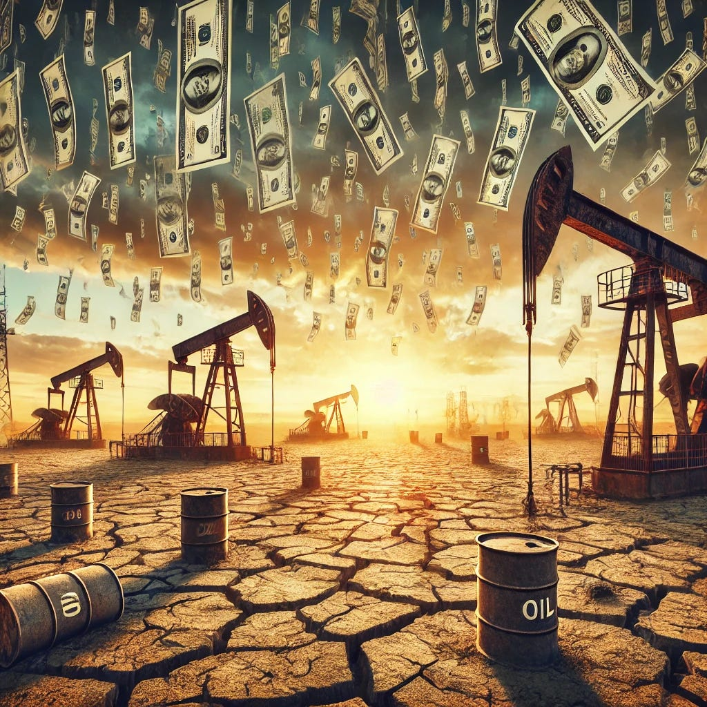
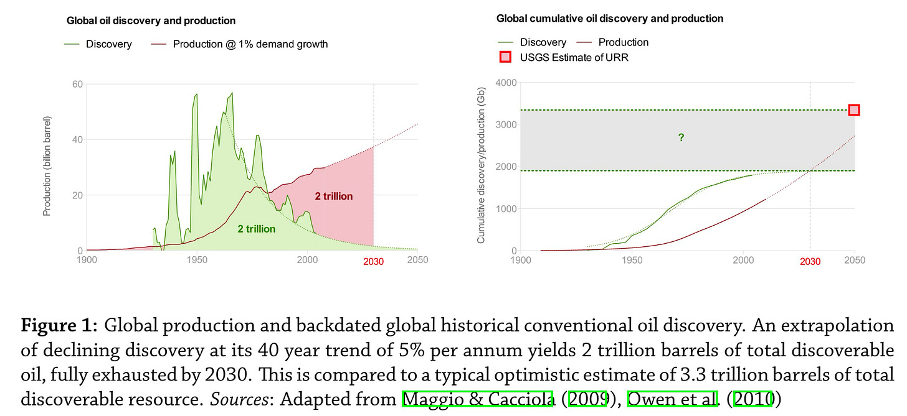
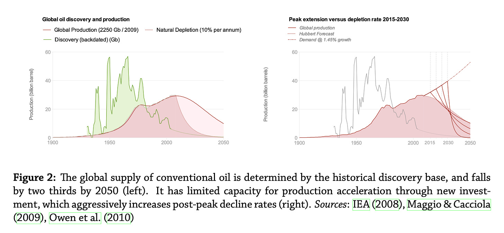

I'll publish an essay shortly on a subject that you will be hearing a lot about soon. It’s called “Modern Monetary Theory” (MMT), an exotic finance scheme supposed by some to allow us to come up with the hundreds of trillions of dollars that replacing affordable, reliable and abundant energy sources with expensive, unreliable and rationed ones will cost, despite us being utterly broke.

To understand MMT—indeed, to understand money—we have to understand the relationship between money and energy. And so, to understand where MMT will take us if we allow it, we have to understand where energy is going.

A few years ago another theory was doing the rounds, one that claimed to predict where energy was going. It was called “Peak Oil”, and it said that the production of oil would soon peak, and that many bad things would follow.

To the untrained eye, the Peak Oil prediction appeared to fail. The production rate of various forms of oil has continued to rise. In this week’s essay, we ask the question: “What happened to Peak Oil”? Spoiler alert: bad things.

I first encountered Peak Oil decades ago when I worked as a Petroleum Engineer at a large oil and gas firm. Someone said: “Lyon. A stupid question keeps coming up at shareholder meetings that oil’s going to peak soon then begin running out. Write me a two pager with the ammunition and I’ll fire it. Shouldn’t be hard”.

I pulled out a few text books, spoke to a few wise people, and wrote the paper. “Yes. Oil is going to peak soon, then begin running out. We should do something about that”.

They asked someone else to write the paper.

Fast forward to 2010. To scratch the itch generated by that essay, I took a masters degree in energy economics. My thesis was called “The Optimism Index: Quantifying the Uncertainty in Energy Policy”.[^1] It turned out that there was quite a lot of optimism in Energy Policy: about 80% of the oil that official energy forecasts relied on didn’t actually exist, and never would. My Institution, which taught a version of economics in which that isn’t supposed to happen, couldn’t find any holes big enough in my argument to block it and had no option but to award a Distinction.

\[For the curious, systems with dynamics that are governed by processes that start out easy and get hard are described by a type of mathematical function called the logistic growth function which, confusingly, has nothing to do with the management term “logistics”. Its characteristic feature is a peak, created by the point at which the things you have done already begin collapsing faster than the new things you do can replace them.\]

Doing the Hard Sums for my thesis, I had to work out what oil discovery volumes there would be in the future. I estimated that 2023’s (for example) would be 5 billion barrels. Lo! Oil discovery in 2023 was 5 billion barrels—a record low.[^2] I mention this, not to boast, but to illustrate a point. At macro scale, the mathematics of systems that are exploited on an “easy first, hard last” basis, and evacuated exponentially, are brutally simple.

The thesis is a little dry and, embarrassingly, in those days I was persuaded by climate catastrophism, it being before I’d actually read any of its eccentric literature. But it has otherwise withstood the test of time.

To set the scene for Modern Monetary Theory, a quick summary of its account of Peak Oil and subsequent events is helpful.

Briefly. To produce oil you have to discover it. We don’t know with certainty how much oil there is, but we do know (reasonably well) how much we’ve discovered. With a bit of simple statistics, we can work out from the patterns to date of discovery and production how much discoverable oil there is left. It’s quite elegant.

\[I’m compressing many important details here for brevity, for example how to reconstruct the discovery profile from annual reserves development records. You could read the thesis.\]

Look at the green curve in the left chart in the figure above. That’s the history of global oil discovery. It started around 1900, paused during war time, then grew strongly. It peaked around 1970, then declined at around 5% per year with a few bumps on the the way down for the last big discoveries (North Sea and Alaska), the recapitalisation of the former Soviet Union, and the development of deepwater technology.

\[Cheap energy makes economies grow. Expensive energy makes them contract. There is an oil price at which economic growth is zero. That partitions oil into two kinds: affordable (economic growth), and unaffordable (economic contraction)\]

A cumulative sum of the discovery profile creates an “S” curve (the right chart). The projection of that curve to the end of time tells you the total amount you’ll ever find, unless technology or commercial arrangements change. That amount is about 2 trillion barrels of affordable oil, of which we’ve produced about 1 trillion barrels. Official oil forecast estimates assume 3 trillion barrels i.e. around 1 trillion barrels of oil that do not and will never exist.

No technology will now materially alter that projection. 1970 was when we landed on the moon. That produced the largest technology disruptions in our history: electronics and miniaturisation; supercomputers and reservoir modelling and simulation; downhole and orbital remote sensing. None of it delayed the peak of discovery, or altered the underlying decline rate.

Oil discovery peaks because we find the big stuff first and the small stuff last. Each new production well starts strongly, then dies away. For commercial reasons, we produce the easy oil first and the hard oil last. Over time, it gets more and more difficult to replace the oil that has died away with new wells. So production also peaks. The rate at which we produce the oil after it peaks then tells you when oil runs out.

In 2006, following a malfunction in the world’s largest reservoir, the supply of affordable oil peaked.

Like a restriction in your steering wheel going round a bend, even a tiny restriction in the supply of oil is disastrous. After affordable oil silently peaked, the price of energy went through the roof. 24 months later, the financial system broke at its weakest link—the subprime mortgage market. We call that the 2008 Great Financial Crash (GFC). It’s still ongoing.

We responded to the GFC by printing trillions of money tokens, and used some of those to start producing a type of oil that had been ignored until then because it is uneconomic—so-called “tight” oil. Free money tokens subsidised and mobilised that oil, and it has provided almost all of the oil growth since.

“Drill, baby, drill!” notwithstanding, tight oil will go on decline soon and there’s nothing material that I know of to replace it. And it doesn’t matter even if there is. Another feature of “easy first hard last systems” is that the timing of the peak is extraordinarily resistent to gross uncertainty. The hypothetical discovery today of an oil volume equivalent to Saudi Arabia—the largest volume every discovered—would shift peak by around 8 years. And there are no Saudi Arabias out there.

Peak oil never went away. We just delayed it for a little while by printing fake money tokens.

Why does this matter?

Since oil dominates our energy system, once it starts to decline, the entire high gradient energy system (the one that powers the global industrial manufacturing system that produces, amongst other things, low gradient wind and sun energy scavenging devices) starts to decline unless and until we ramp up gas and nuclear.

Goosing our production with funny money is a zero sum game. The more we’ve delayed peak, the faster it will decline on the other side. The faster energy declines, the harder the economic shock. There is a rate of economic shock, above which, the entire financial system collapses.

And now, the scientifically and economically illiterate United Kingdom government is shuttering our oil and gas fields, and using printed money tokens to fund low gradient energy scavenging technologies that accelerate the resulting energy decline even faster.

In the next essay, on the brink of baked-in and accelerated energy decline, we’ll pick up the story of money token printing theory—a.k.a “Modern Monetary Theory”—to see how it is like pouring petrol on inflationary flames.

[^1]: Lyon, R. (2010). The Optimism Index: Quantifying the uncertainty of energy policy. Unpublished masters thesis. The Centre for Energy, Petroleum and Mineral Law and Policy, Dundee. Available at https://www.dropbox.com/scl/fi/ii5pl2vfnmjcz0n4ic8z1/Lyon-2010-The-Optimism-Index-Quantifying-the-uncertainty-of-energy-policy.pdf?rlkey=pqlkednziosojiumlovotrmgs&dl=0

[^2]: Global Oil and Gas Discoveries Fell to a Record Low in 2023 | OilPrice.com (no date). Available at: https://oilprice.com/Latest-Energy-News/World-News/Global-Oil-and-Gas-Discoveries-Fell-to-a-Record-Low-in-2023.html?t (Accessed: 8 December 2024).

