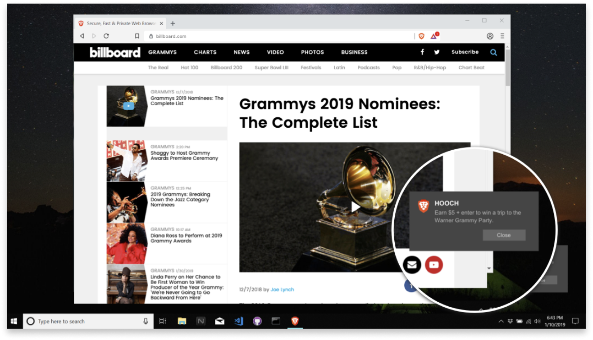

\[2020 update: Since I published this piece in December 2019, Brave has updated its website. I’ve changed certain links to point at pages on the Internet Archive so that readers can judge the validity of the citations at the time I wrote them.\]

The regret is sincere. I’ll never be a fan of JavaScript. But Brendan Eich achieved something authentically great with Mozilla. In 1998, while still a Netscape employee, he helped start the Mozilla project. Starting in 2003, he worked at Mozilla for 11 years, shipping influential software, especially the Firefox web browser. But more than that, a core part of Mozilla’s identity has always been its excellent ethics around open source and web citizenship. That would’ve been a terrific legacy for any software engineer.

Apparently, however, Mr. Eich has undergone some kind of late-career conversion to the dark side of the force. With Brave, Mr. Eich wants to ruin my work—and that of every other creator who’s still propping up what’s left of the ad-free internet—so that he (and his venture investors) may profit. How? By layering ads over my ad-free website, while convincing web users that they’re part of some virtuous new economy.

\[Image from Brave’s website, showing how their system layers an ad over the currently viewed web page (as an OS notification). Emphasis theirs.\]

Sorry Mr. Eich, but I refuse to cooperate. As soon as I figure out how to detect the Brave web browser by technological means—a task you’re deliberately making difficult, because you know that many publishers would like to do the same—I will make sure that every Brave visitor gets this as their landing page.

Because they deserve to know that Brave is bullshit.

## What is brave?

For web users, Brave is a company, founded by Mr. Eich, that makes an eponymous web browser. According to Brave, its browser offers two key benefits:

1. The “speed, security, and privacy” that comes from automatically blocking ads and trackers.

2. The virtuous pleasure of giving “publishers back their fair share of Internet revenue.”

Before we go further, let’s notice that Brave’s pitch blatantly sidesteps the fact that web publishers already have a preferred way of getting their “fair share” of online revenue: ads.

Hey, I don’t like those ads either. Though I’m skeptical that blocking them does much good in the aggregate.

\[Mr. Eich himself has compared Brave to chlorine, a metaphor that might’ve been more thoroughly considered\]